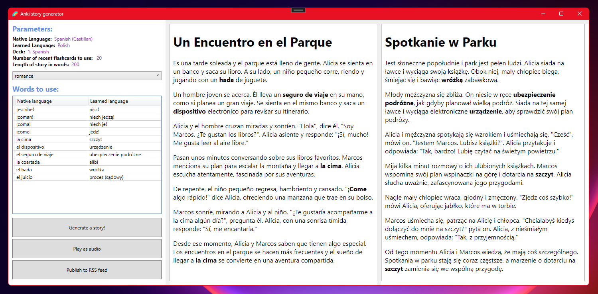

# Anki Story Generator

## Goal of the project

Generates stories in a foreign language to help users better memorize the words in a foreign language they recently learned in Anki. OpenAI API powers the story generation.

This project is a proof-of-concept to check if such a project works reasonably well and to help me see if:

- The generated stories are fun to read and something I would like to use myself.
- Such an additional form of review improves memory encoding or retrieval and allows learning words more effectively.
- Such an idea can work well with relatively unstructured decks (e.g., fields containing my comments in mixed languages).

## Status of the project: paused

A working proof of concept was created:

Then I paused the project, so I could focus on other priorities first.

## Lessons learned

1. **The story generation process works fine:** Generating the story which contains specific words is relatively easy with the use of the Generative AI tools, which handle the job of including unrelated words in the story quite well.
2. **Difficulty level can be controlled:** A good prompt allows steering the difficulty level, suitable for A1-A2 level students by asking for stories in the present tense.
3. **Grammatical correctness seems fine:** The stories generated with this proof-of-concept are grammatically correct, and the narration makes sense. But...
4. **Storytelling quality is mediocre:** The biggest issue I see is a lack of good storytelling. I don't expect a Pulitzer prize level here, but stories totally lack in building tension, plot twists and being fun. Possible improvement can be done by refining the prompt, selecting the best AI model for the job, or adding more passes asking the tooling to refine the text to gain some particular qualities.
5. **Audio generation is fine:** Generating audio is also easily doable and provides high-quality speech for popular languages like Spanish or English, making it suitable for listening practice.
6. **Integration with Anki:** Handling the variety of inputs in Anki notes is the biggest challenge if there was a desire to release this project publicly as different note types can have their own structure of fields.

## Ideas for the future

There are several improvements that could be attempted to make this program better, and I would rank them in this order:

1) Try to improve the storytelling quality in the generated content.
2) Consider publishing the stories to RSS feed (currently partially implemented), so they can be used for the listening practice on a smartphone.
3) Theoretically, it would be possible and fun to generate illustrations for the stories as well. It would probably not have an impact on learning efficiency, but maybe it could help to make the generated content more fun and increase the chance of using the tool more often.
